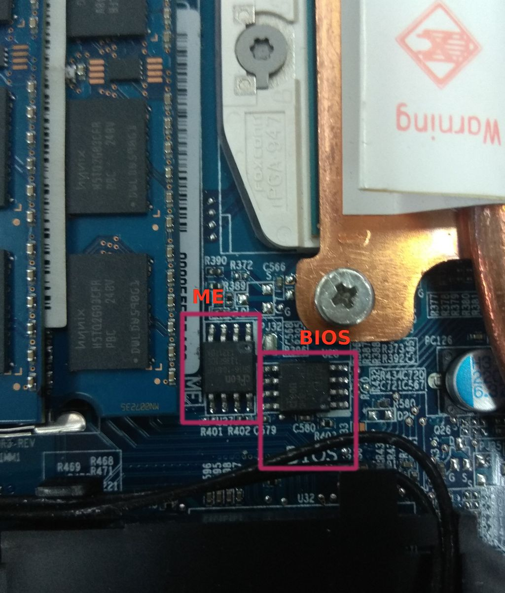

# Clevo W650SZ

This page describes how to run coreboot on Clevo W650SZ.

## Required proprietary blobs

```eval_rst
Please see :doc:`../../northbridge/intel/haswell/mrc.bin`.
```

## Flashing coreboot

### External programming

Clevo W650SZ has two SOIC-8 flash chips. They're labeled "BIOS" and "ME"
on the mainboard. The flash chip containing the BIOS is 4MB. It can be
programmed with an SOIC-8 clip and a flash programmer (e.g. CH341a).

Below is a picture of the flash chips on the mainboard.



After building coreboot, you get a 6MB firmware image. You need to split
out the 4MB BIOS region as follows, and flash to the 4MB chip.

```bash
dd if=build/coreboot.rom of=bios-4M.rom bs=1M skip=2
```

### Internal programming

When coreboot is installed, you can do the internal flashing with flashrom.

You need to unlock the IFD first. Read the 2MB chip, unlock the IFD using
ifdtool as follows, then flash it back to the 2MB chip. In this example,
the 2MB chip is read out as me.rom.

```bash
util/ifdtool -u me.rom
```

After IFD is unlocked, you can do the internal flashing as follows.

```bash
sudo flashrom -p internal:laptop=force_I_want_a_brick \
   --ifd --image bios -w build/coreboot.rom
```

## Working

- i7-4800MQ, 4G+4G, 8G+8G
- initialisation with Haswell mrc version 1.6.1 build 2
- integrated graphics
- graphics init with libgfxinit
- S3 suspend/resume
- internal flashing under coreboot
- Using `me_cleaner`
- USB
- Gigabit Ethernet
- WLAN
- SATA, mSATA
- keyboard
- touchpad
- HDMI
- VGA
- audio
- webcam

## Not Working

- EHCI debug: console message stops after mrc.bin initializes USB
- EC ACPI (including battery and AC status)

## Technology

```eval_rst
+------------------+--------------------------------------------------+
| Northbridge      | :doc:`../../northbridge/intel/haswell/index`     |
+------------------+--------------------------------------------------+
| Southbridge      | Intel Lynx Point (HM86)                          |
+------------------+--------------------------------------------------+
| CPU              | Intel Haswell (FCPGA946)                         |
+------------------+--------------------------------------------------+
| EC               | ITE IT8587E                                      |
+------------------+--------------------------------------------------+
| Coprocessor      | Intel Management Engine                          |
+------------------+--------------------------------------------------+
```
